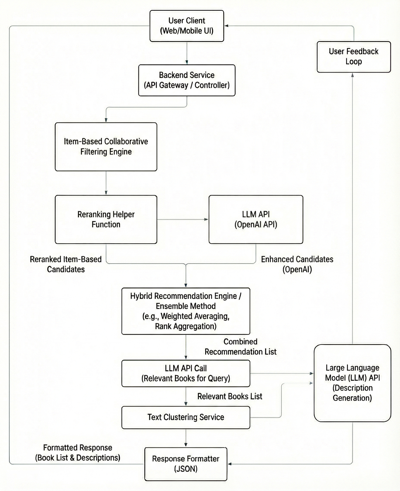

# Book-recommendation-system
A hybrid book recommendation system that leverages collaborative filtering with the large language models to recommend highly relevant book list to the user

### Brief description of the project

Identifying the right books and information for academic or personal growth purposes can be a daunting task for many users, particularly traditional search engines, which rely on keyword searches. These search engines might produce irrelevant results instead of relevant books that are in the interests of the students. 

To eliminate the unnecessary search results, this project introduces an AI-powered recommender system that takes users' interests into account by expanding the query based on the search query using generative large language models and retrieves relevant books with authors and publication information from the databases. The system combines content-based filtering using item-user matrices, text clustering techniques and generative AI models to produce accurate and precise book recommendations to the users.

### Repository structure

```
/book-recommendation-system
├── environment.yml         # Conda environment file for dependencies
├── .gitignore              # Git ignore file
├── LICENSE                 # Project license file
├── README.md               # This README file
│
├── /data/                  # Directory for storing datasets (e.g., ratings, books info)
│
├── /nbs/                   # Directory for Jupyter notebooks (e.g., EDA, model prototyping)
|
|-- /feedback/              # user feedback folder
|
|-- /assets/                # artifacts folder
| 
|-- /tests/                 # code test file
│
├── ├── main.py             # FastAPI application entry point, defines API endpoints
│   ├── collabfiltering.py  # Module for collaborative filtering logic
│   └── llmrec.py           # Module for LLM-based recommendation logic
|   |__ clustering.py
│
└── |── app.py              # Main Streamlit application file (the user interface)
```

### System diagram



### Benefits of the system

A book recommendation system can have many benefits for the students and users alike. Here are the motivations and benefits of the project:

- To streamline the book search and recommendation using the latest AI models 
- Help students to ease the book search and retrieve accurate and precise book recommendations for certain keywords
- Demonstration of the traditional search techniques with the latest generative AI models 
- Leverage generative AI model capabilities to describe book content and expand user queries to many keywords
- Demonstrate the use case of the hybrid retrieval recommendation systems

### Technical Solution

- User interface to take the book ISBN number as input 
- User query ISBN number will be fed to the API call to generate relevant new book titles or themes that align with the user query
- Book query will find similar items from the database based on the item similarity algorithm
- Generative AI-generated keywords will also retrieve relevant book titles or similar items from the database to find similar items to the user query and rerank them based on relevance
- Combined retrieved results from both functions will then be clustered into groups to generate a detailed description of each recommendation using a large language model API call
- Finally, the retrieved results will be presented to the user on the user interface and users will be asked to provide the feedback on the recommendations
- Results can be evaluated based on the Precision-Recall curve, RMSE, MAP and relevance judgment scoring, such as discounted cumulative gains, to ensure the system is validated for real-world use cases.
- For the book recommendation system, tools such as OpenAI/HuggingFace, Streamlit for the UI, FastAPI, the scikit-learn toolkit, LangChain, pandas, numpy, and the Matplotlib visualisation toolkit are used.

### Tools and techniques used

- FastAPI
- Pandas
- Singular Vector Decompositin (SVD)
- OpenAI
- K-means clustering
- Streamlit
- Docker
- Numpy

### Setting up the project
1. Clone the Repository

```
git clone https://github.com/avikumart/Book-recommendation-system.git
cd Book-recommendation-system
```
2. Create and Activate Conda Environment

- This project uses Conda to manage dependencies. you need to have a Anaconda installed in your PC in order to create the conda virtual environment
```
# Create the environment from the .yml file
conda env create -f environment.yml

# Activate the environment
conda activate book-rec-system 
```

- (Note: Replace book-rec-system if your environment.yml specifies a different name).

3. Add Data
- This project requires book and rating datasets to function. Place your raw data files (e.g., books.csv, ratings.csv) into the /data/ directory on your local.

4. Set Up API Keys
- The LLM features (e.g., OpenAI) require an API key. Set this as an environment variable. A common way to do this is to create a .env file in the /backend directory:

```
File: /.env

OPENAI_API_KEY='your_api_key_here'
```

- The backend code (e.g., in app.py, main.py or llmrec.py) will need to be configured to load this variable.

5. Run the Frontend Application (Streamlit)
- Open a new terminal. Activate your conda environment again in this new terminal.
```
# Make sure you are in the root project directory
conda activate book-rec-system
streamlit run app.py
```
- Your default web browser should open automatically to the Streamlit app, which will be available at http://localhost:8501.

### Acknowledgements

1. Pro. Xiao Hu, Assistant Professor, College of Information Science, University of Arizona
2. College of Information Science, University of Arizona
